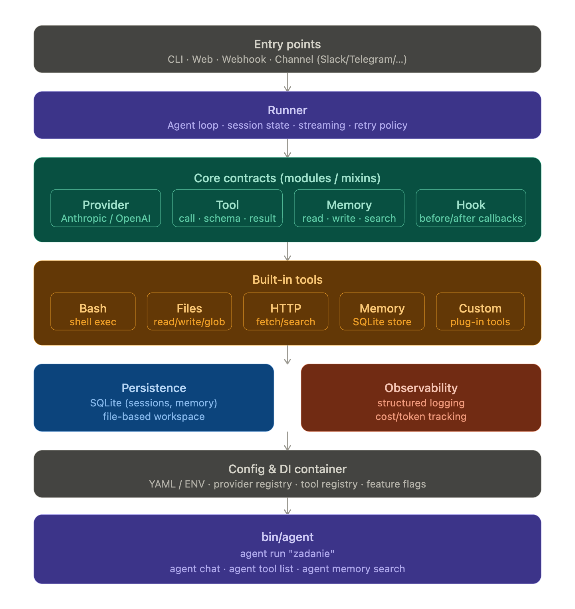

# Akaitsume

赤い爪 — A sharp, extensible AI agent framework for Ruby built on the Anthropic SDK.

## Features

- **Provider abstraction** — swap LLM backends without changing agent code (Anthropic built-in, OpenAI/Ollama ready to add)
- **Tool system** — trait-based tools with auto-discovery: Bash, Files, HTTP, Memory
- **Memory backends** — FileStore (default) or SQLite, switchable via config
- **Session management** — conversation continuity with token/cost tracking
- **Hooks** — `before_tool`, `after_tool`, `on_response`, `on_error` callbacks
- **Structured logging** — JSON logs with token counts and tool durations
- **Thor CLI** — `run`, `chat`, `tools`, `memory` commands with auto-generated help

## Installation

```ruby
# Gemfile
gem 'akaitsume'
```

Or install directly:

```sh
gem install akaitsume
```

## Quick start

```sh
export ANTHROPIC_API_KEY=sk-...

# Single prompt
akaitsume run "list files in the current directory"

# Interactive chat (with conversation memory)
akaitsume chat

# List available tools
akaitsume tools

# Show/search agent memory
akaitsume memory show
akaitsume memory search "ruby"
```

## Usage from Ruby

```ruby
require 'akaitsume'

agent = Akaitsume::Agent.new

# Simple run
result = agent.run("What files are in the workspace?")
puts result

# With hooks
agent.before_tool { |name, input| puts "Calling #{name}..." }
agent.on_response { |text| puts "Got: #{text}" }
agent.run("Create a hello.txt file")

# Chat with session continuity
session = Akaitsume::Session.new
agent.run("Remember: my name is Mateusz", session: session)
agent.run("What's my name?", session: session)

# Sub-agents
researcher = agent.spawn(name: "researcher", role: :researcher)
researcher.run("Find all TODO comments in the codebase")
```

## Configuration

Config is loaded from YAML, environment variables, or passed directly:

```yaml
# config/agent.yml
model: claude-sonnet-4-20250514
max_turns: 20
max_tokens: 8096
workspace: ~/.akaitsume/workspace
memory_backend: file        # or "sqlite"
db_path: ~/.akaitsume/akaitsume.db
log_level: info
```

```sh
akaitsume run "hello" --config config/agent.yml
```

Environment: `ANTHROPIC_API_KEY` is required.

## Architecture



> Greyed-out elements (Web/Webhook entry points, streaming, retry policy, session persistence, feature flags) are planned for future phases.

```
lib/akaitsume/
├── agent.rb              # Orchestrator (agentic loop)
├── cli.rb                # Thor CLI
├── config.rb             # YAML + ENV config
├── hooks.rb              # Event system module
├── logger.rb             # Structured JSON logging
├── session.rb            # Conversation state + token tracking
│
├── provider/
│   ├── base.rb           # Provider contract (module)
│   ├── response.rb       # Unified response value object
│   └── anthropic.rb      # Anthropic SDK wrapper
│
├── tool/
│   ├── base.rb           # Tool contract (module)
│   ├── registry.rb       # Tool registry
│   ├── bash.rb           # Shell execution
│   ├── files.rb          # File operations (with path traversal protection)
│   ├── http.rb           # HTTP requests via Faraday
│   └── memory_tool.rb    # LLM-facing memory read/write/search
│
└── memory/
    ├── base.rb           # Memory contract (module)
    ├── file_store.rb     # Markdown file backend (default)
    └── sqlite_store.rb   # SQLite backend (opt-in)
```

## Extending

### Custom tool

```ruby
class MyTool
  include Akaitsume::Tool::Base

  tool_name   'weather'
  description 'Get current weather for a city'
  input_schema({
    type: 'object',
    properties: {
      city: { type: 'string', description: 'City name' }
    },
    required: ['city']
  })

  def call(input)
    # Your implementation here
    "Weather in #{input['city']}: 22C, sunny"
  end
end

# Register it
agent = Akaitsume::Agent.new
registry = Akaitsume::Tool::Registry.new
registry.register(MyTool)
agent = Akaitsume::Agent.new(tools: registry)
```

### Custom provider

```ruby
class OllamaProvider
  include Akaitsume::Provider::Base

  provider_name 'ollama'

  def chat(messages:, system:, tools:, model:, max_tokens:)
    # Call Ollama API, return Provider::Response
    Akaitsume::Provider::Response.new(
      content: [...],
      stop_reason: 'end_turn',
      model: model,
      usage: { input_tokens: 0, output_tokens: 0 }
    )
  end
end

agent = Akaitsume::Agent.new(provider: OllamaProvider.new)
```

### Custom memory backend

```ruby
class RedisStore
  include Akaitsume::Memory::Base

  def read       = # ...
  def store(entry) = # ...
  def replace(content) = # ...
  def search(query) = # ...
end

agent = Akaitsume::Agent.new(memory: RedisStore.new)
```

## Dependencies

| Gem | Purpose |
|-----|---------|
| `anthropic` | Anthropic Claude SDK |
| `zeitwerk` | Autoloading |
| `faraday` | HTTP tool |
| `sqlite3` | SQLite memory backend |
| `thor` | CLI framework |

## License

MIT
